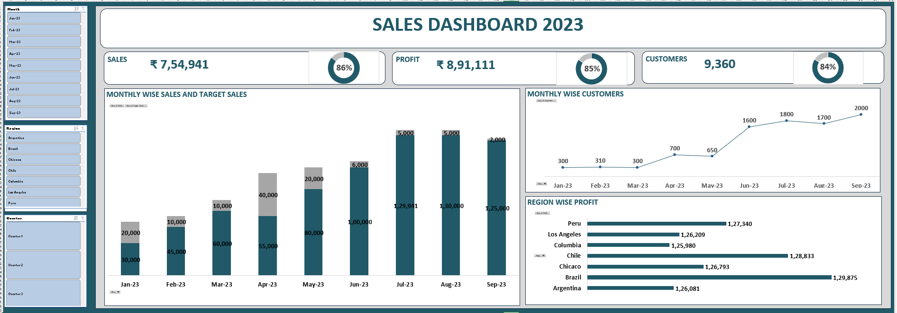

# Sales Analysis Dashboard | Microsoft Excel

## Project Overview

This project analyzes sales performance using Microsoft Excel to identify trends in sales, profit, targets, customers, and regional performance.

## Tools & Techniques

- Microsoft Excel
- Pivot Tables
- Charts
- Data Analysis
- Dashboard Development

## Analysis Performed

- Monthly sales and profit analysis
- Regional sales performance
- Target vs actual sales
- Customer analysis
- Profit performance analysis
- Sales performance tracking

## Dashboard

The project includes an interactive Excel dashboard with charts and key performance indicators to summarize sales performance.

## Key Insights

- Analyzed sales and profit performance across different periods and regions.
- Compared actual sales against sales targets.
- Identified areas of stronger and weaker sales performance.
- Used charts and dashboard elements to present business insights clearly.

## Dashboard Preview

## Project File

[Download Excel Dashboard](./Sales_Analysis_Dashboard.xlsx)
